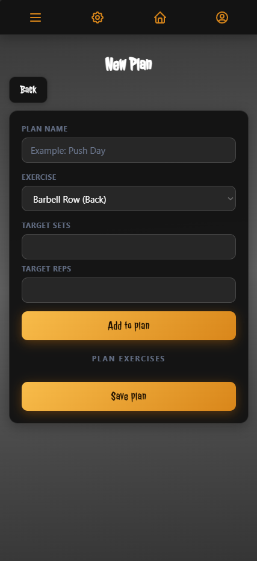
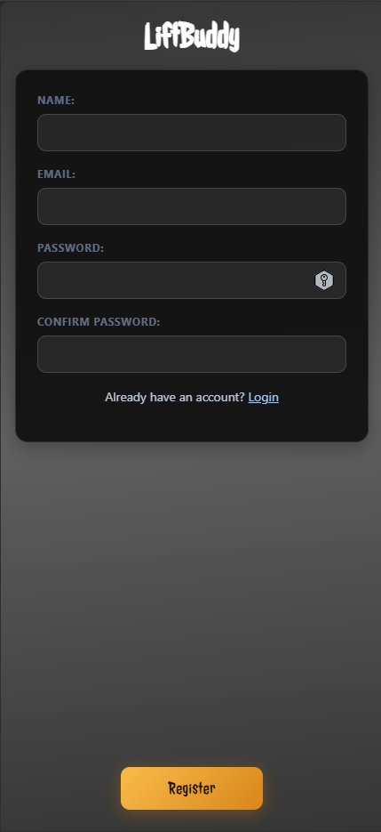

# LiftBuddy

A mobile-first fitness tracking web app built as a single-page application (SPA). LiftBuddy lets you create training plans, track your workout sessions, log sets/reps/weight and see your progress over time.

---

## Screenshots

| Login | Home | Session |
|---|---|---|
|  |  |  |

---

## Features

- **Authentication** — Register, login, logout with secure token-based auth (30-day expiry)
- **Training Plans** — Create, view and delete custom workout plans with exercises
- **Session Tracking** — Start a session from any plan, log actual sets, reps and weight per exercise
- **Progress Stats** — See total volume moved per session and percentage improvement vs. the previous run of the same workout
- **Profile Management** — Update username and email
- **Account Settings** — Change password, deactivate account
- **Security** — Rate limiting on auth endpoints, bcrypt password hashing, server-side password policy, XSS protection via HTML escaping, access control on all API routes

---

## Tech Stack

| Layer | Technology |
|---|---|
| Frontend | Vanilla JavaScript (ES Modules), HTML5, CSS3 |
| Backend | Node.js, Express.js |
| Database | SQLite (via `sqlite3`) |
| Auth | Custom Bearer Token + bcryptjs |
| Security | express-rate-limit, bcryptjs |
| Font | [Jolly Lodger](https://fonts.google.com/specimen/Jolly+Lodger) (Google Fonts) |

No frontend framework — built with plain ES modules and a custom SPA router.

---

## Project Structure

```
LiftBuddyV1/
├── backend/
│   ├── middleware/
│   │   └── requireAuth.js      # Auth middleware for protected routes
│   ├── models/
│   │   └── users.js
│   ├── routes/
│   │   ├── auth.js             # Register, login, logout, profile, password
│   │   ├── exercises.js        # Exercise catalogue
│   │   ├── plans.js            # Training plan CRUD + start session
│   │   ├── sessions.js         # Session tracking + finish
│   │   └── workouts.js         # Legacy workout routes
│   ├── database.js             # SQLite setup & migrations
│   └── server.js               # Express entry point
└── frontend/
    ├── pages/
    │   ├── home.js             # Plan overview
    │   ├── newPlan.js          # Create plan
    │   ├── planDetail.js       # Plan detail + start training
    │   ├── sessionDetail.js    # Active session with live input
    │   ├── login.js
    │   ├── register.js
    │   ├── profile.js
    │   ├── settings.js
    │   └── menu.js
    ├── helpers/
    │   └── api.js              # Shared fetch helper (attaches auth header)
    ├── app.js                  # SPA router + auth state
    ├── index.html
    └── style.css               # Glassmorphism design system
```

---

## Getting Started

### Prerequisites

- [Node.js](https://nodejs.org/) v18 or higher

### Installation

```bash
# Clone the repository
git clone https://github.com/your-username/LiftBuddyV1.git
cd LiftBuddyV1

# Install backend dependencies
cd backend
npm install
```

### Run

```bash
# From the /backend directory
npm start
```

Then open [http://localhost:3000](http://localhost:3000) in your browser.

> The Express server serves both the API and the frontend statically — no separate dev server needed.

---

## API Overview

All endpoints except `/api/auth/*` require an `Authorization: Bearer <token>` header.

| Method | Endpoint | Description |
|---|---|---|
| POST | `/api/auth/register` | Create account |
| POST | `/api/auth/login` | Login, receive token |
| POST | `/api/auth/logout` | Invalidate token |
| POST | `/api/auth/token-login` | Validate stored token |
| PUT | `/api/auth/profile` | Update username / email |
| PUT | `/api/auth/change-password` | Change password |
| PUT | `/api/auth/deactivate` | Deactivate account |
| GET | `/api/plans` | List all plans |
| POST | `/api/plans` | Create plan |
| GET | `/api/plans/:id` | Plan detail with exercises |
| POST | `/api/plans/:id/start` | Start a session from a plan |
| GET | `/api/sessions/:id/detail` | Session detail |
| PUT | `/api/sessions/:id/exercises/:exId` | Update exercise log |
| POST | `/api/sessions/:id/finish` | Finish session |
| GET | `/api/exercises` | Exercise catalogue |

---

## Security Highlights

- Passwords hashed with **bcrypt** (cost factor 10)
- Password policy enforced on both client and server: min. 8 characters, uppercase, lowercase, number and special character required
- Auth tokens are **random 64-character hex strings** with a 30-day expiry — invalidated immediately on logout
- **Rate limiting**: 10 login attempts / 15 min, 5 registration attempts / hour
- **Ownership checks** on all data endpoints — users can only access their own plans, sessions and workouts
- HTML output escaped throughout the frontend to prevent XSS
- CORS restricted to `localhost:3000`

---

## License

MIT
